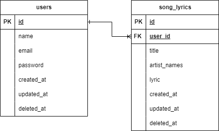

# Lirikku API <!-- omit from toc -->

## Table of Contents <!-- omit from toc -->

- [Entity Relational Diagram (ERD)](#entity-relational-diagram-erd)
- [Usecase Diagram](#usecase-diagram)
- [Tools](#tools)
- [Endpoint](#endpoint)
  - [Auth](#auth)
  - [My song lyrics](#my-song-lyrics)
  - [Public song lyrics](#public-song-lyrics)
  - [More info](#more-info)
- [How to run with docker](#how-to-run-with-docker)
- [How to run without docker](#how-to-run-without-docker)

## Entity Relational Diagram (ERD)



## Usecase Diagram


## Tools


## Endpoint

### Auth

| Method | Endpoint       | Description                                 |
| ------ | -------------- | ------------------------------------------- |
| POST   | /auth/register | Register new user (**json body**: register) |
| POST   | /auth/login    | Login user (**json body**: login)           |

### My song lyrics

| Method | Endpoint               | Description                                                                 |
| ------ | ---------------------- | --------------------------------------------------------------------------- |
| GET    | /song_lyrics/my        | Get all (**query param**: pagination)                                       |
| GET    | /song_lyrics/my/{id}   | Get by id                                                                   |
| GET    | /song_lyrics/my/search | Search by title/artist_names/lyric (**query param**: search_my, pagination) |
| POST   | /song_lyrics/my        | Save (**json body**: save_my)                                               |
| DELETE | /song_lyrics/my/{id}   | Delete                                                                      |
| PUT    | /song_lyrics/my/{id}   | Update                                                                      |

### Public song lyrics

| Method | Endpoint                         | Description                                        |
| ------ | -------------------------------- | -------------------------------------------------- |
| GET    | /song_lyrics/public/search       | Search by term (**query param**: pagination, term) |
| POST   | /song_lyrics/public/search/audio | Search by audio file (**form-data**: audio)        |

### More info

1. **Query Param**:
   - pagination: page=`number (more than 0, default 1)`&page_size=`number (more than 0, default 5)`
   - search_my: title=`string`&artist_names=`string`&lyric=`string`
   - term: term=`string`
2. **Schema Request Json Body**:

   - register:

   ```json
   {
     "name": "string (required)",
     "password": "string (required, min 8 chars)",
     "email": "string (required,email format)"
   }
   ```

   - login:

   ```json
   {
     "username": "string (required, min 8 chars)",
     "password": "string (required, email format)"
   }
   ```

   - save_my:

   ```json
   {
     "title": "string (required)",
     "artist_names": "string (required)",
     "lyric": "string (required)"
   }
   ```

3. Schema Response

   - Success song lyrics my & public

     - Success Singgle Data

     ```yaml
     # my
     {
       'message': string,
       'my_song_lyrics':
         { 'id': int, 'title': string, 'artist_names': string, 'lyric': string },
     }
     # public
     {
       'message': string,
       'public_song_lyrics':
         { 'title': string, 'artist_names': string, 'lyric': string },
     }
     ```

     - Success Multiple Data

     ```yaml
     # my
     {
       'message': string,
       'my_song_lyrics':
         [{ 'id': int, 'title': string, 'artist_names': string, 'lyric': string }],
     }
     # public
     {
       'message': string,
       'public_song_lyrics':
         [{ 'title': string, 'artist_names': string, 'lyric': string }],
     }
     ```

   - Success login

   ```yaml
   { 'message': string, 'token': string }
   ```

   - Error (for all endpoint) & Success without data (delete, update, save, register)

   ```yaml
   { 'message': string }
   ```

## How to run with docker

1. Clone this repository
2. Set environment variable in `.env.production` file, based on `.env.example` file
3. Run `docker build -t <image_name>:<tag_name> .`
4. Run `docker run -d -p 8000:8000 --env-file=<env_file> <image_name>:<tag_name>` `

   **note**: create your own container database (mysql) or use cloud database (aws rds, gcp cloud sql, etc) and set environment variable in `.env.production` file

## How to run without docker

1. Clone this repository
2. Set environment variable in `.env.production` file, based on `.env.example` file
3. Run `go mod download`
4. Run `go run .`
